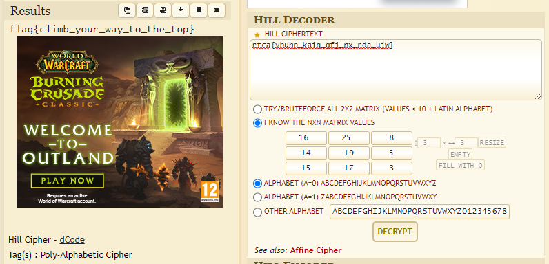

# Queen of the Hill
> Points: 221

## Challenge description
>After finding a special key of the Hill, which contains a note to visit the Queen of the Hill, our brave Amanda begins her adventure to find the Queen of the Hill’s treasure. How shall she meet the Queen of the Hill? (a=0)
>
>Cipher text: rtca{vbuhp_kaiq_gfj_nx_rda_ujw}
>
>Encryption key:
>
>16 25 8
>
>14 19 5
>
>15 17 3

## Challenge analysis
After reading the description, I immediately saw the "Hill" keyword, which is a Hill cipher. We were also given the matrix values. So I jumped on to [dcode.fr](https://www.dcode.fr/hill-cipher) website, where I solved the challenge.  

I inserted the 3x3 matrix values and got the flag:

The flag: flag{climb_your_way_to_the_top}

