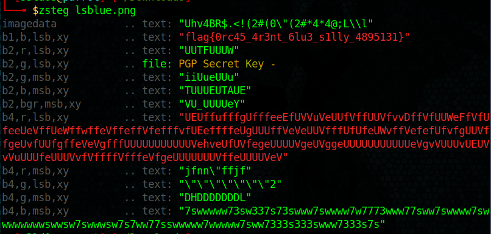

# LSBlue
>Points: 220

## Challenge description
>Orca watching is an awesome pastime of mine!
>
>Downloads: [LSBlue.png](LSBlue.png)

## Challenge analysis
This was a classical image stego challenge. We get a big hint from the png file **LSB**lue, which means it's hiding something inside the Least Significant Bits of the colors.
I used zsteg tool, and got the flag hiding inside the LSB of blue color.

Flag: flag{0rc45_4r3nt_6lu3_s1lly_4895131}

