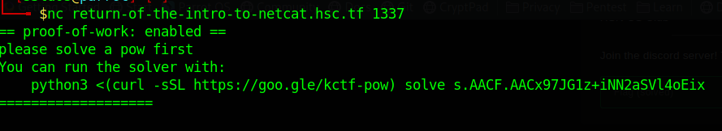
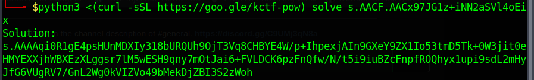
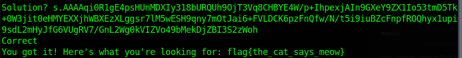

# Return of the Intro to Netcat
>Points: 160

## Challenge description
>hey, netcat seems fun! (with a twist)
>
>`nc return-of-the-intro-to-netcat.hsc.tf 1337`

## Challenge analysis
I fired up NetCat on my terminal, typed in `nc return-of-the-intro-to-netcat.hsc.tf 1337`and got this:

So it's some kind of a POW to solve. Fired up another terminal (left the nc terminal open) and put this command inside: `python3 <(curl -sSL https://goo.gle/kctf-pow) solve s.AACF.AACx97JG1z+iNN2aSVl4oEix`

And got the solution of the POW:

After this, the only thing left to do was, to copy-paste the solution and we get the flag:

Flag: flag{the_cat_says_meow}

