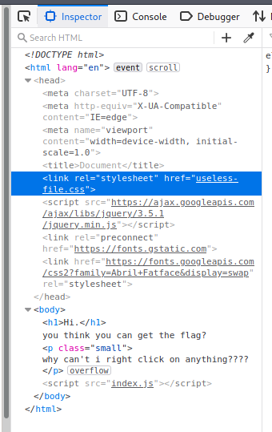
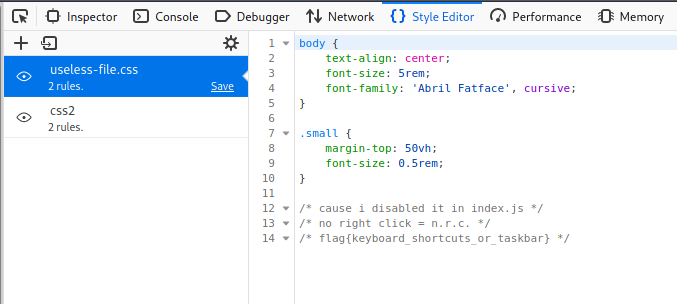

# NRC
>Points: 107

## Challenge description
Find the flag :)

[no-right-click.hsc.tf](no-right-click.hsc.tf)

## Challenge analysis
We were given a link to a website in which the flag was hiding. When we access this website, we're greeted with this:

I immediately wanted to check the source code, but there was a catch! We couldn't right click it, so I just pressed **F12** key and I got the source code:

Useless-file.css caught my eye, I opened it in the Style Editor and got the flag:

Flag: flag{keyboard_shortcuts_or_taskbar}

This was a **very** easy web challenge!
