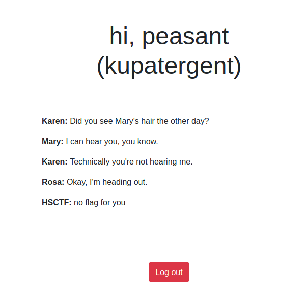
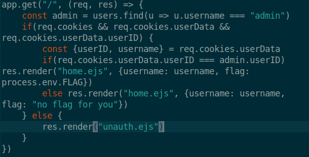
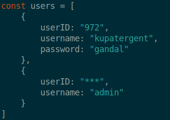

# Message-board
>Points: 305

## Challenge description
Your employer, LameCompany, has lots of gossip on its company message board: [message-board.hsc.tf](message-board.hsc.tf). You, `Kupatergen`, are able to access some of the tea, but not all of it! Unsatisfied, you figure that the admin user must have access to ALL of the tea. Your goal is to find the tea you've been missing out on.

Your login credentials: username: `kupatergent` password: `gandal`

Server code is attached (slightly modified).

Downloads: [message-borard-master.zip](message-board-master.zip)

## Challenge analysis
First, I logged in to the website using the credentials that were given to us above. I came to this screen:


Sadly, we had no flag (yet). After my initial website check, I downloaded the ZIP file that had the source code that was slightly modified. After inspecting the app.js code, something caught my eye:



In short: It was checking whether our cookie **UserID** matched to the **AdminID**. 

In the beginning of the application, there is a constant **users** in which, both Admin and our user (Kupatergent) are defined:


As we can see Admin's **UserID** got removed, so our job was to somehow get his **UserID**. I wrote a slightly unpractical small Bash script in terminal, which brute forces the **UserID** using **cURL**.

The script that I wrote: 
```bash
for num in {000..999}; do curl -v --cookie userData=j%3A%7B%22userID%22%3A%22$num%22%2C%22username%22%3A%22admin%22%7D https://message-board.hsc.tf/ -o output.txt; done
```

After the script finished with bruteforcing all possible values from 000-999, I used `cat output.txt | grep flag{` and got the flag!

Flag: flag{y4m_y4m_c00k13s}

